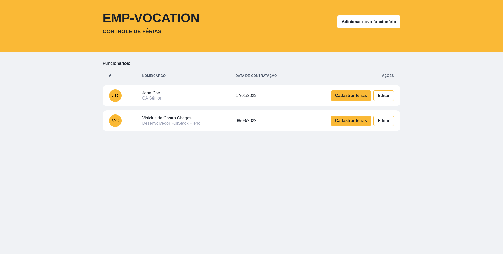
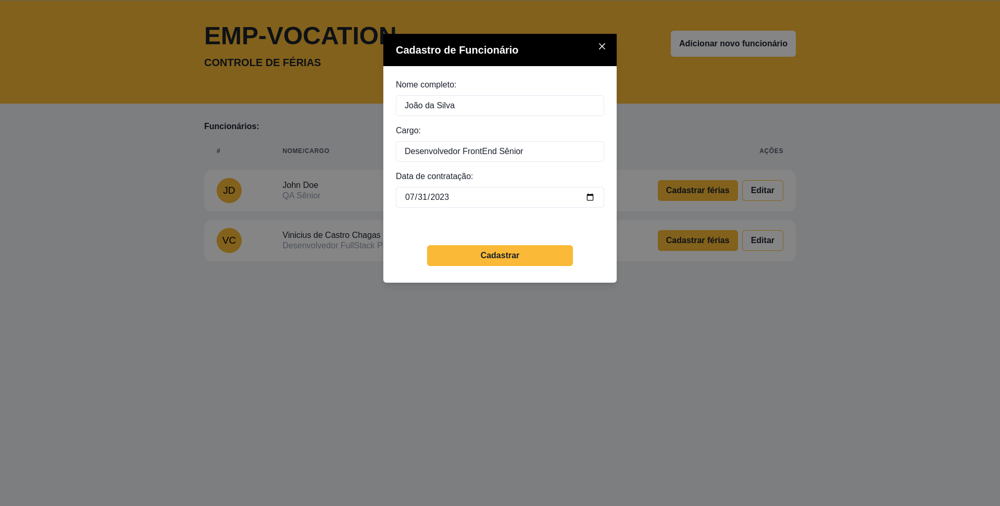
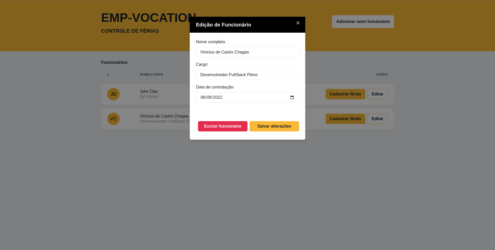
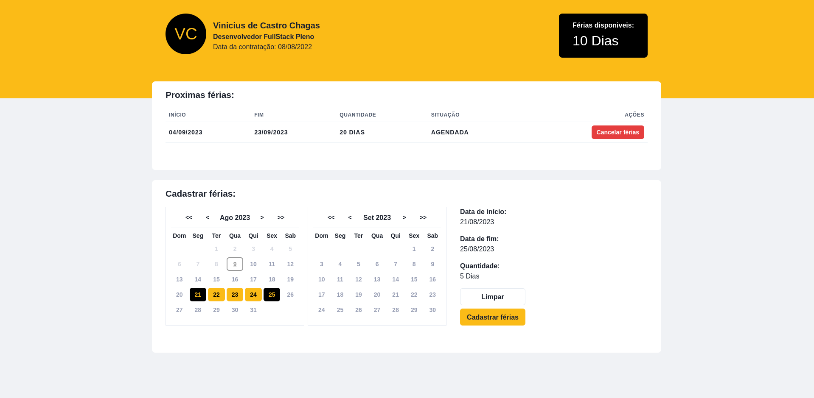

## Links Uteis

<li>Online Preview: <a href="https://minhaagenda-viniciuscchagas.vercel.app/" target="_blank">Link</a></li>

## Instruções para uso

#### ATENÇÃO: Este projeto depende do seu BackEnd para funcionar corretamente!

Link do repositório do backend: [https://github.com/ViniciusCChagas/backend-emp-vocation](Repositório)

### 1. Clonar repositório

Você pode clonar esse repositório utilizando o comando: <br>

```bash
$ git clone https://github.com/ViniciusCChagas/frontend-emp-vocation
```

ou você pode baixar o repositório como um arquivo .ZIP

### 2. Instalar as dependências

Após isso, na pasta do projeto rode o comando

```bash
$ npm install
#ou
$ yarn
```

para instalar todas as dependencias do projeto. <br>

### 3. Rodar a aplicação

Depois de instalar todas as dependencias do projeto, vamos executa-lo em modo de desenvolvimento, utilizando o comando:

```bash
$ npm run dev
# ou
$ yarn dev
```

Após isso podemos acessar o App no endereço: [http://localhost:3000](http://localhost:3000) e conferir o resultado.

</br>
</br>

## Algumas imagens do projeto

#### Lista de funcionários cadastrados:



<br/>

#### Formulário de cadastro de novo funcionário:



<br/>

#### Formulário de edição de funcionário:



<br/>

#### Perfil do funcionário / Formulario de cadastro de férias:



<br/>
<br/>
<br/>
<br/>

## Ferramentas utilizadas

<li>NextJS</li>
<li>ChakraUI</li>
<li>Date-fns</li>
<li>ContextAPI</li>
<li>TypeScript</li>
<li>Sass</li>
